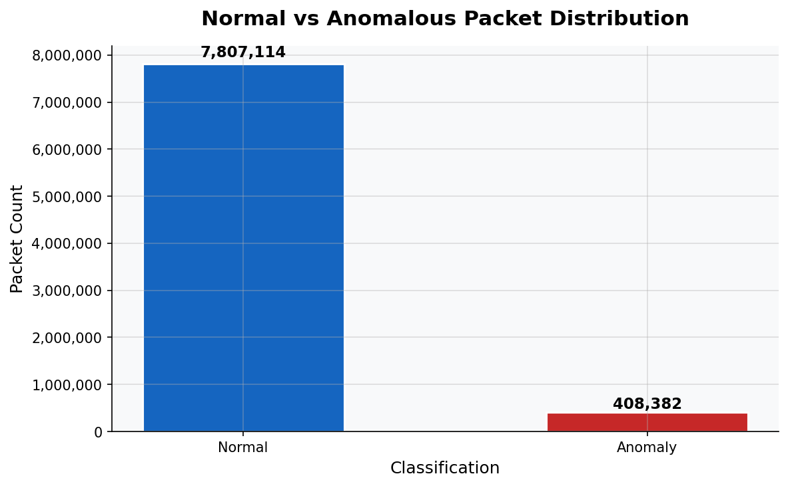
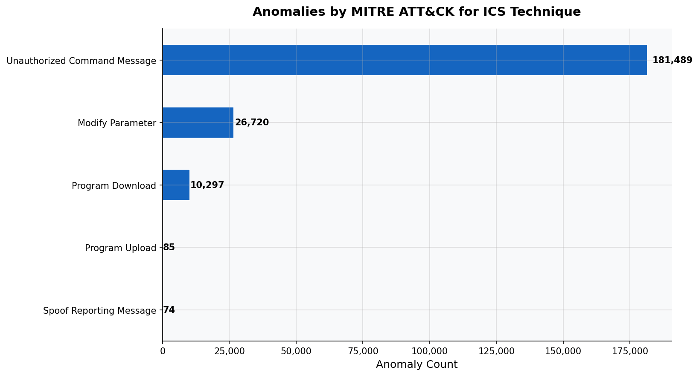

# Modbus TCP Anomaly Detection — Power Grid OT Security

Python | Scapy | PyShark | Scikit-learn | MITRE ATT&CK for ICS

---

## Overview

This project builds a behavioral anomaly detection system targeting
Modbus TCP traffic on port 502 in energy sector operational technology
environments. It started as a question I kept coming back to while
doing packet analysis work in CYBR 202 at the University of Tennessee.
Once you spend enough time in Wireshark reading through real traffic
you start wondering what malicious traffic actually looks like and
whether you could write something that flags it automatically.

My interest in IT and infrastructure security pushed me toward ICS
and OT specifically. Most security problems in enterprise IT result
in data loss or downtime. Security failures in operational technology
environments can result in physical consequences. That difference in
stakes is what makes this area worth understanding seriously.

The 2015 Ukraine power grid attack is what pointed me toward Modbus
TCP. The attackers moved through industrial control systems without
triggering anything. Part of why that worked is because Modbus has
no built-in authentication. Any device on the network can send
commands to a PLC directly. This project is an attempt to build
something that catches the behavioral patterns those kinds of
attacks produce.

---

## What It Does

Parses Modbus TCP traffic from raw PCAP files using PyShark and
extracts protocol-level features including function codes,
transaction IDs, packet length, and inter-packet timing. Engineers
behavioral features from those to represent normal operational
patterns. Trains an Isolation Forest model on clean baseline
traffic to detect deviations without relying on known signatures.
Maps all flagged anomalies to the MITRE ATT&CK for ICS framework
and produces visualizations and a written threat assessment.

---

## Dataset

**ICS-PCAPS — University of Coimbra CyberSec Team**
Labeled Modbus TCP traffic published alongside research at CRITIS
2018. Contains six labeled attack categories including Modbus query
flooding, man-in-the-middle manipulation, TCP SYN flood, ping
flood, and clean baseline traffic.

Citation: Frazao et al., Denial of Service Attacks: Detecting the
frailties of machine learning algorithms in the Classification
Process, CRITIS 2018, Springer.
DOI: 10.1007/978-3-030-05849-4_19

**4SICS GeekLounge ICS Traffic Captures**
Real ICS network traffic captured at the 4SICS industrial
cybersecurity conference in Stockholm, 2015.

---

## Project Structure
---

## How to Run

```bash
git clone https://github.com/Damonlee005/Modbus-OT-Threat-Detection-Energy-Sector
cd Modbus-OT-Threat-Detection-Energy-Sector
python3 -m venv venv && source venv/bin/activate
pip install -r requirements.txt
python scripts/parser.py
python scripts/features.py
python scripts/detector.py
python scripts/mitre_mapping.py
python scripts/visualize.py
```

---

## MITRE ATT&CK for ICS Coverage

| Technique ID | Technique | Tactic |
|---|---|---|
| T0802 | Automated Collection | Collection |
| T0814 | Denial of Service | Inhibit Response Function |
| T0830 | Adversary-in-the-Middle | Collection |
| T0836 | Modify Parameter | Impair Process Control |
| T0843 | Program Download | Lateral Movement |
| T0845 | Program Upload | Collection |
| T0855 | Unauthorized Command Message | Impair Process Control |
| T0856 | Spoof Reporting Message | Impair Process Control |
| T0861 | Point & Tag Identification | Discovery |

---

## Threat Assessment

A full written threat assessment is in reports/threat_assessment.md.
It covers methodology, dataset documentation, attack scenario
analysis, risk to process integrity and safety systems, and
remediation recommendations aligned to NERC CIP CIP-007.

---

## Results

| Metric | Value |
|---|---|
| Total packets analyzed | 8,215,496 |
| Anomalies detected | 408,382 |
| Detection rate | 4.97% |
| MITRE techniques mapped | T0836, T0843, T0845, T0855, T0856 |

---

## Visualizations

### Normal vs Anomalous Packet Distribution


### Anomalies by MITRE ATT&CK for ICS Technique

